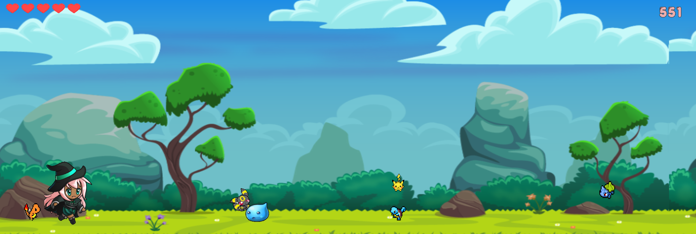

# Jogo 2d Criado na Imersão Game Dev da Alura

## Tecnologias Utilizadas:
- HTML
- CSS
- JavaScript
- Biblioteca P5.js

## Link jogável no p5.js
https://editor.p5js.org/carol_lira/full/SwjGrb3ey

## Para baixar e rodar localmente
1. Faça download ou clone o repositório
2. Instale o node.js
3. Instale o HTTP server: npm install http-server -g
4. Vá para a pasta do projeto via cmd
5. Rode o comando: http-server
